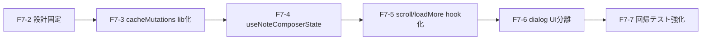

# 目的

- `AuthedScreen.tsx` の責務を分割し、F7-3〜F7-7を追加判断なしで実装できる状態にする。
- 分割後も既存UX/仕様契約を維持する。
- 回帰確認ポイントを段階ごとに固定し、F7-7のテスト強化へ接続する。

# スコープ

- 対象
  - 分割単位（hook/lib/dialog）の定義
  - 依存関係と段階導入順の定義
  - 回帰確認ポイント（Unit/結合/Playwright）
  - 完了条件（DoD）と不変条件の定義
- 非対象
  - 実コード変更
  - 新規テスト実装
  - 計測結果の記録（F7-8で実施）

# 現状責務マップ（AuthedScreen）

`mono-log9-app/components/authed/AuthedScreen.tsx`（1367行、2026-03-02時点）

| 区分 | 現状責務 | 代表箇所（目安） | 分割先 |
| --- | --- | --- | --- |
| 画面制御 | URL正規化・view/favorite導出・一覧条件算出・表示切替 | `normalizedQuery/listCondition` 周辺（285-317） | `AuthedScreen` に残置（オーケストレーション） |
| 遷移ガード | hasEdits時の保留遷移/確定遷移/破棄確認 | `useGuardedQueryNavigation` 利用（259-283） | 既存 `useGuardedQueryNavigation` 維持 |
| Note Composer状態 | create/edit初期化、欠損時クローズ、復元ドラフト適用 | effect本体（656-756） | `useNoteComposerState`（F7-4） |
| キャッシュ更新 | favorite同期、move/restore、完全削除、fallback invalidate | `update*Cache*` 群と操作ハンドラ（542-1231） | `lib/posts/cacheMutations`（F7-3） |
| スクロール復元 | 保存キー管理、復元制御、cleanup保存、popstate上書き抑止 | 399-453 | `usePostsScrollRestoration`（F7-5） |
| 追加読み込み | IntersectionObserver監視、抑止条件付き fetchNextPage | 495-540 | `useInfiniteLoadMore`（F7-5） |
| ダイアログUI | 破棄確認と完全削除確認のJSX/文言 | 1324-1363 | `DiscardConfirmDialog` / `TrashDeleteDialog`（F7-6） |
| 認証導線 | 401時ログインモーダル表示、再ログイン下書き保存/復元 | 350-385、1317-1323 | 現段階は `AuthedScreen` 残置（F7対象外） |

# 分割後アーキテクチャ

## 方針

- `AuthedScreen` は「状態の接続・props受け渡し・副作用起動条件の最終決定」に限定する。
- 更新規則は pure function に寄せ、UI層からロジックを分離する。
- URL/遷移/履歴の契約（hasEdits保留・noteComposer履歴連動）は現仕様を不変とする。

## 構成（F7-3〜F7-6後）

- `components/authed/AuthedScreen.tsx`
  - 画面の統合点（Query、Server Action、各hook、UIコンポーネント接続）
- `components/authed/useGuardedQueryNavigation.ts`（既存）
  - 離脱確認付き遷移ガード
- `components/authed/useNoteComposerState.ts`（新規、F7-4）
  - Note Composer 初期化/復元/欠損時クローズ制御
- `components/authed/usePostsScrollRestoration.ts`（新規、F7-5）
  - スクロール保存/復元制御
- `components/authed/useInfiniteLoadMore.ts`（新規、F7-5）
  - 追加読み込み監視制御
- `components/authed/DiscardConfirmDialog.tsx`（新規、F7-6）
  - 破棄確認ダイアログ
- `components/authed/TrashDeleteDialog.tsx`（新規、F7-6）
  - ごみ箱完全削除ダイアログ
- `lib/posts/cacheMutations.ts`（新規、F7-3）
  - 一覧キャッシュ更新規則（純関数）

# I/F設計（固定）

## F7-3: `lib/posts/cacheMutations.ts`

```ts
type CacheMutationContext = {
  condition: PostsListCondition;
  items: PostRecord[];
};

export function upsertForCurrentView(
  context: CacheMutationContext,
  updated: PostRecord
): PostRecord[];

export function applyFavoriteMutation(
  context: CacheMutationContext,
  updated: PostRecord
): PostRecord[];

export function applyMoveToTrashMutation(
  context: CacheMutationContext,
  input: { postId: string; movedPost: PostRecord | null }
): PostRecord[];

export function applyRestoreFromTrashMutation(
  context: CacheMutationContext,
  input: { postId: string; restoredPost: PostRecord | null }
): PostRecord[];

export function applyDeletePostsMutation(
  context: CacheMutationContext,
  deletedPostIds: string[]
): PostRecord[];
```

- 規約
  - 副作用禁止（`queryClient` は受け取らない）
  - 引数は不変入力として扱う
  - 戻り値のみで更新結果を返す

## F7-4: `components/authed/useNoteComposerState.ts`

```ts
type UseNoteComposerStateInput = {
  effectiveQueryString: string;
  noteComposer: { mode: "none" | "create" | "edit"; postId?: string };
  isNoteModalOpen: boolean;
  noteModalDirty: boolean;
  visibleItems: PostRecord[];
  restoredNoteDraft: ReloginNoteDraft | null;
  listState: { hasData: boolean; isFetching: boolean };
  findInCachedPostLists: (postId: string) => PostRecord | null;
  closeNoteModalNow: () => void;
  onMissingTarget: (nextQuery: string) => void;
  onConsumeRestoredDraft: () => void;
};

type UseNoteComposerStateOutput = {
  noteModalMode: "create" | "edit";
  editingNotePostId: string | null;
  noteModalInitialTitle: string;
  noteModalInitialContent: PostContent | null;
  noteModalInitialPlainText: string;
};
```

- 規約
  - 欠損投稿時は `onMissingTarget` を呼び、親で `syncCommittedQuery + router.replace` を実行
  - create/edit初期化シグネチャ管理はhook内で完結
  - 復元ドラフトの消費タイミングは `onConsumeRestoredDraft` で親状態へ反映する

## F7-5: `components/authed/usePostsScrollRestoration.ts`

```ts
type UsePostsScrollRestorationInput = {
  listCondition: PostsListCondition;
  scrollStorageKey: string;
  listReady: boolean;
  isQueryNormalizing: boolean;
};

type UsePostsScrollRestorationOutput = {
  isRestoringScroll: boolean;
  saveCurrentScroll: () => void;
  markBeforeRouteChange: () => void;
};
```

- 規約
  - popstate中の `scrollY=0` で既存値を上書きしない
  - 復元中フラグは `useInfiniteLoadMore` の抑止条件として利用

## F7-5: `components/authed/useInfiniteLoadMore.ts`

```ts
type UseInfiniteLoadMoreInput = {
  hasNextPage: boolean;
  isFetchingNextPage: boolean;
  isRestoringScroll: boolean;
  hasNextPageError: boolean;
  isQueryNormalizing: boolean;
  fetchNextPage: () => Promise<unknown>;
};

type UseInfiniteLoadMoreOutput = {
  loadMoreSentinelRef: (element: HTMLDivElement | null) => void;
};
```

- 規約
  - 追加取得の多重発火を禁止
  - 失敗時は自動再試行せず、ユーザー再試行導線に委譲

## F7-6: ダイアログUIコンポーネント

```ts
type DiscardConfirmDialogProps = {
  open: boolean;
  onOpenChange: (open: boolean) => void;
  onConfirm: () => void;
};

type TrashDeleteDialogProps = {
  open: boolean;
  mode: "selected" | "all" | null;
  selectedCount: number;
  submitting: boolean;
  errorMessage: string | null;
  onOpenChange: (open: boolean) => void;
  onConfirm: () => void;
};
```

- 規約
  - 文言責務はコンポーネント側に集約
  - submit中の close 抑止契約は維持

# 依存関係と段階導入順



| フェーズ | 主変更 | 依存 | 完了判定 |
| --- | --- | --- | --- |
| F7-3 | キャッシュ更新規則を pure function 化 | F7-2 | `AuthedScreen` から更新規則分岐が除去される |
| F7-4 | Note Composer 初期化/復元をhookへ移管 | F7-3（推奨） | note関連effectの主処理がhookへ移る |
| F7-5 | scroll復元/IO監視をhookへ移管 | F7-4（推奨） | scroll/observer系effectが `AuthedScreen` から減る |
| F7-6 | 破棄確認/完全削除ダイアログ分離 | F7-5（推奨） | JSX終端のダイアログ重複が解消される |
| F7-7 | 回帰テスト補強 | F7-3〜F7-6 | 分割起因回帰を自動検知可能になる |

# 互換条件（不変条件）

- hasEdits離脱確認
  - 保留中は遷移先UIを表示しない（ちらつかせない）
  - 「編集を続ける」で保留破棄、「破棄して続行」で保留適用
- URLクエリ状態
  - `view/favorite/noteComposer` 契約を維持
  - 未知クエリの保持を維持
- キャッシュ整合
  - favorite on/off 双方向同期
  - move/restore/完全削除の一覧反映
- スクロール/無限読み込み
  - 戻る/進む時の復元維持
  - 復元中は追加読み込みを抑止
- UI/文言
  - 既存文言と挙動を変えない（見た目変更を目的にしない）

# 禁止事項

- DBスキーマ変更、マイグレーション、データ更新は実施しない。
- 設計メモ段階で仕様変更を混入しない。
- 分割時に `AuthedScreen` の責務を無秩序に別ファイルへ拡散しない（I/F固定後に移す）。

# 回帰確認ポイント（F7-7に接続）

## Unit候補

- `cacheMutations`
  - favorite ON/OFF
  - moveToTrash / restoreFromTrash
  - delete selected / empty trash
- `useNoteComposerState`
  - create/edit 初期化
  - missing target 時のクローズ要求
  - dirty時のクローズ連動境界
- `usePostsScrollRestoration` / `useInfiniteLoadMore`
  - 復元中抑止
  - 追加取得再試行条件

## 結合/E2E維持観点

- 結合
  - `AuthedScreen` の主要導線（編集、favorite、ごみ箱、再試行、履歴遷移）が既存同等
- E2E
  - `has-edits.spec.ts`
  - `note-composer-history.spec.ts`
  - `favorite-filter.spec.ts`
  - `trash-delete.spec.ts`
  - `infinite-scroll.spec.ts`

## 基準コマンド

- Jest
  - `pnpm exec jest components/authed/__tests__/useGuardedQueryNavigation.test.ts components/authed/__tests__/AuthedScreen.test.tsx --runInBand`
- Playwright
  - `pnpm exec playwright test has-edits.spec.ts note-composer-history.spec.ts favorite-filter.spec.ts trash-delete.spec.ts infinite-scroll.spec.ts`

# F7-2 Done条件

- [x] 分割単位がファイル単位で定義されている
- [x] 各分割先のI/F（入力/出力/責務）が明記されている
- [x] F7-3〜F7-7の段階導入順と依存関係が定義されている
- [x] 各段階の回帰確認ポイント（Unit/結合/E2E）が定義されている
- [x] 実装者が追加判断なしでF7-3に着手できる
