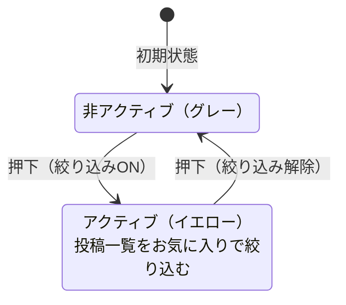

# システム構成

- パッケージマネージャー
	- pnpm
- アプリ
    - Next.js
    - tiptap
	    - 投稿エディタのリッチテキスト入力に使用。投稿本文は tiptap の JSON 形式で DB に保存する
    - prisma
    - dayjs
	    - 投稿の作成日・更新日の日時フォーマット表示に使用（表示フォーマット: `YYYY-MM-DD HH:mm`）
    - TanStack Query
	    - 投稿一覧のキャッシュ・再検証・無限スクロールのデータ取得に使用（詳細は「投稿データ取得・キャッシュ戦略（TanStack Query）」を参照）
- デザインシステム
	- storybook（検討中、初期リリース時は導入しない）
- テスト
    - Jest（単体テスト、結合テスト）
    - Playwright（E2Eテスト）
- UI
    - shadcn/ui
    - tailwindcss
- アイコン
	- https://lucide.dev/
- DB
    - 種類とバージョン: PostgreSQL v17
    - ローカル: ローカル用PostgreSQL
    - 検証用: Neon
    - 本番用: Neon
- 認証
	- Auth.js
- ホスティング
	- Vercel

# 基本仕様

- SPA
	- 画面状態（モード/ごみ箱/絞り込み）は URL パラメータで切り替える
	- モード切替やごみ箱表示の切替では、取得済みの投稿一覧が即時に復元される（体感の速さを優先）
		- 実装設計は `50_取得-キャッシュ-ページング.md` を参照
- ブラウザ
	- 以下を対象とする
		- PC用Webブラウザ（Chrome, Firefox, Safari, Edge の最新版）
		- スマートフォン用Webブラウザ（iOS Safari, Android Chrome の最新版）
- スマートフォンのホーム画面追加
	- ホーム画面追加（PWA）に対応する（manifest を用意する）
	- 起動時はアプリっぽく起動する（standalone）
	- 具体のキー/アイコン/テーマカラー等の設計は `docs/03.v2/02_設定-環境変数-PWA.md` を参照する
- デザイン・レイアウト
		- 画面のレイアウトは別途資料（Miro）を正とし、スマートフォン相当とPC画面相当のレイアウトで実装する
		- Miro の参照は MCP（`mcp-miro`）経由で行い、ボードIDは設定（`mcp.json`）から取得する（ハードコードしない）

---

# ログインボタン

- ボタン押下でログイン用モーダルウィンドウを表示する
- モーダル内に「Googleでログイン」ボタンを表示する
- ログインボタンを押下すると認証処理を実行する。成功したら、未ログイン用のウェルカムメッセージ／ログインボタンを非表示にし、ログイン中画面に表示を切り替える
- モーダルの右上のバツボタンを押下するとモーダルが解除される
- 認証に失敗/キャンセルした場合はエラー通知（トースト）を表示し、モーダルは閉じる（再試行は再度ログイン操作から行う。文言は `docs/05.テキスト・コンテンツ定義.md` を正とする）

---

# ユーザーアイコン

- Google認証想定。googleからユーザーのアイコン画像を取得し表示する
- ログアウト機能
	- アイコンを押下するとポップオーバーが開き、ユーザー名と「ログアウト」を表示する
	- ユーザーアイコンまたはポップオーバー以外のエリアをクリックすると閉じる
	- 「ログアウト」リンクを押下するとログアウトする
		- ログアウト成功時: URL パラメータを全削除して `/` に戻し、未ログイン画面へフェードインで切り替える（ログアウト専用画面は作らない）
		- ログアウト失敗時: エラー通知（トースト）を表示し、未ログイン画面へは切り替えない（リトライ可能）
- 将来的にユーザー固有機能の設定を追加予定（内容未定）

---

# 表示切り替えUI

- 構成要素
	- 「メモ」ボタン
		- 押下するとメモの投稿一覧が表示される
	- 「ノート」ボタン
		- 押下するとノートの投稿一覧が表示される
	- 「ごみ箱」ボタン
		- 押下するとごみ箱の投稿一覧が表示される 
- 各モードとごみ箱は URL クエリで判定し、ブラウザでの進む/戻るで状態を保存できるようにする
- 各ボタンが押下されるとそのボタンがアクティブになり、それ以外のボタンは非アクティブになる

---

# 投稿一覧

- タイトル
- お気に入りボタン
	- 表示されているメモ・ノートの一覧をお気に入り設定した投稿で絞り込むことができる
	- デフォルトは非アクティブ（グレーアウト）、押下するとアクティブ（イエロー）になる。

- **投稿一覧の仕様**
	- 現在アクティブになっているモードの一覧を表示する
		- モード切り替えUIの操作によって自動的にパラメータが付与・変更される
			- URLパラメーターによってモードを判定する
			- デフォルトのモードはメモ
	- 投稿を立て一列で並べるシンプルなレイアウトで表示する
	- 直近n件を表示する（初期値は10アイテム）
	- 投稿の並び順の初期値は投稿作成日時の降順（新しいものが上）
	- **取得した投稿一覧はキャッシュする**
		- キャッシュを利用し、表示を切り替えたりブラウザの進む/戻るボタンを押下しても取得済みの投稿は即時に復元される
		- キャッシュ方針（通常/ごみ箱）: `staleTime=5分` / `gcTime=30分`、`refetchOnMount/Focus/Reconnect=false`
		- スクロール位置は「表示中の一覧条件」単位で保存され、一覧復元後に可能な範囲で復元される
		- モード切り替え、投稿編集、お気に入りフラグ脱着をおこなった場合、キャッシュを更新する

---

# 投稿一覧 個別の内容

- 各投稿の表示要素
	- 所属するモード（メモ／ノート）
	- 作成日（投稿日、**絶対時刻**。表示: `YYYY-MM-DD HH:mm`）
	- 投稿本文
		- メモ（`mode=memo`）: 全文表示する
		- ノート（`mode=note`）: **最大10行まで表示（表示上の10行）**
			- 10行を超える場合は「もっと見る / 折りたたむ」で開閉できる
			- 初期状態は折りたたみ（10行まで表示）
			- ノートがタイトルを持っていれば、本文の代わりにタイトルを表示する
		- ごみ箱アイコン（削除）
			- 投稿をごみ箱に移動するためのボタン。押下すると投稿一覧からは非表示になる
	- 編集ボタン
		- メモ： 押下すると、その投稿の表示領域を **インライン編集**する（ノートエディタに差し替え）
		- ノート: 押下すると、モーダルでノートエディタを表示する
	- 星型アイコン（お気に入りフラグ）
		- 用途：投稿へのお気に入り付与/解除（モード切り替え「お気に入り絞り込み」に利用）
		- 押下するとスターがグレーからイエローに変化する
		- イエローのときに押下するとグレーに戻る

# 投稿の自動取得（無限スクロール）

- 投稿一覧が表示されているページをスクロールし最下部に到達したとき、次のn件を自動的に取得開始する。
- 取得を待っている間はスケルトンUIを表示する。

---

# エディタ

- エディタはメモ用、ノート用の2つのコンポーネントで分けて実装する
- 保存されたメモとノートは互換性を持たない

- メモエディタ
	- inputフィールド
		- 一行テキスト（短文）を入力する想定のinputフィールドを設置
		- urlはリンクに変換する機能を持つ
	- 追加ボタン
		- 押下するとメモが保存される

- ノートエディア
	- タイトル入力エリア
		- 未入力可。
		- バリデーション内容未定
	- テキスト入力エリア
		- 長文を入力する想定のリッチテキストエディタを設置する（TipTap）
		- マークダウン風のショートカット入力（例: `#` で見出し、`- [ ]` でタスク等）を許可する
	- 「保存する」ボタン
		- 押下するとノートが保存される

- メモ・ノートエディタの共通仕様
	- 保存の際は、現在アクティブなモードが設定される（モードはURLパラメーターで識別する）
	- 押下すると投稿内容、モード、日時が保存される
	- 保存完了後は以下の状態にする
		- エディタの入力内容をクリアする
		- 再びエディタにフォーカスを当てる
		- 本文が未入力（空白のみ含む）の場合は保存を行わず、Alertで未入力であることを通知する
		- 本文の最大文字数を超える場合は保存を行わず、Alertで通知する
			- `mode=memo`: 最大 全角140文字 / 半角280文字
			- `mode=note`: 最大 全角25,000文字

- **既存メモ・ノートの編集**
	- キャンセルボタン
		- 既存メモ・ノートの編集時のみ表示する
		- 押下すると編集状態から通常表示に戻る
	- 投稿のモードは変更できない（編集時も固定）
	- 編集中の離脱（未保存変更あり）
		- `hasEdits`：編集開始時点の内容と比べて、未保存の変更がある状態
		- 新規投稿の未保存入力も同様に `hasEdits` として扱い、モード変更前に確認を表示する
		- 新規ノートの拡大/縮小は入力内容を破棄しないため、`hasEdits` の確認対象外とする
		- `hasEdits=true` のときに以下の操作を行う場合は確認を表示する
			- モード切替 / お気に入り絞り込み / ごみ箱表示切替など、URLパラメータが変わる操作
			- 他の投稿の編集を開始する操作
			- ノート編集モーダル（またはSheet）のクローズ操作（× / Esc / 背景クリック）
			- ブラウザの戻る/進む、リロード、タブを閉じる
		- ただし、**現在と同じ状態への切替**で URL が変わらない場合は操作を無視し、確認は表示しない
		- 確認の選択肢
			- 「破棄して続行」：編集を破棄して操作を実行する
			- 「編集を続ける」：操作をキャンセルし、編集状態を維持する
				- URLパラメータが変わる操作の場合、URL変更も取り消し（元のURLに戻す）編集状態を維持する

---

# モード別エディタ表示

- エディタ表示は `mode` パラメーターで出し分ける
- `mode=memo`
	- メモエディタのみ表示する
- `mode=note`
	- エディタはモーダルの中に配置する（初期非表示）
	- 「ノートを書く」ボタンを押下するとモーダルが開く
- ノートモーダルのクローズ挙動
	- クローズ操作（ヘッダの閉じる、Esc、背景クリック）は同一のクローズ要求として扱う
	- 入力が空（trim後0文字）の場合はそのまま閉じる
	- 入力が1文字以上ある場合は確認アラートを表示する
		- 「破棄して閉じる」: モーダルを閉じ、入力をクリアする
		- 「編集を続ける」: モーダルを閉じず、入力を保持する

---
# ごみ箱

## 一覧表示

- ごみ箱に移動された投稿は一覧で表示される
- 一覧表示は通常の投稿一覧と同じレイアウトの一覧コンポーネントを利用する
- ごみ箱内の投稿は「ごみ箱に入れた順（新しい→古い）」で表示する

## ごみ箱の投稿個別

- 以下の機能を持つ
	- チェックボックスでチェックの着脱
	- 復元
		- 押下するとごみ箱から非表示になり、元々属していたモードに復元される
	- 完全削除
		- 一覧から削除され、データベースから削除される。

## 削除操作UI

- ごみ箱内の投稿すべてに一括でチェックを脱着する機能がある
- ごみ箱表示から通常のモード表示（メモ・ノート）に戻ったら、投稿のチェックボックスはリセットする

- **UI**
	- 「表示中の投稿を選択」チェックボックス
		- ロード済みの投稿全てにチェックを付ける
			- 無限スクロールで追加ロードされた投稿は自動でチェックしない
		- 1件以上の投稿にチェックが入っているときは、「選択を解除」チェックボックスに入れ替わる
	- 「選択を解除」チェックボックス
		- チェックが付いている投稿の選択をすべて解除する
		- 一部の投稿だけにチェックが入っている場合でも、押下時は選択中の投稿を全解除する（仕様意図）
	- n件を選択中
		- チェックが付いてる投稿の数を表示する
		- 投稿のチェックを監視し、着脱に応じて件数表示を動的に更新する
	- 「選択した​投稿を​削除」ボタン
		- チェックボックスにチェックが付いている投稿のみ完全削除する
	- 「ごみ箱を空にする」ボタン
		- チェックの有無にかかわらず、未ロード分の投稿も含めて全てのごみ箱内の投稿を完全に削除する

## 投稿の完全削除

- 投稿の完全削除を実行するときは、かならず削除確認モーダルを表示してユーザーに確認を促す
- 削除確認モーダル
	- 確認メッセージは操作に応じて分岐する（文言は `docs/05.テキスト・コンテンツ定義.md`「削除確認モーダル」を参照）
		- 複数選択削除: n=チェック数
		- ごみ箱を空にする: 全件（件数表示なし）
	- 警告メッセージ（この操作は取り消せません）
	- キャンセルボタン：モーダルを閉じる
		- 削除ボタン：対象の投稿を完全に削除し、成功通知を表示する
		  - 失敗した場合はエラー通知（トースト）を表示し、再試行できる導線を提供する（状態維持）
		  - 本モーダルは一括削除（複数選択削除／ごみ箱を空にする）でのみ使用する

---

# エラーハンドリング

- 各種アクション、認証・通信エラー時に必要なフィードバックを適切表示する
  - ログイン（OAuth）失敗/キャンセル: トースト表示、モーダルは閉じる（再試行は再度ログイン操作から行う。文言は `docs/05.テキスト・コンテンツ定義.md` を正とする）
  - ログイン必須操作で 401: トースト表示＋入力維持のままログインモーダル自動表示
  - 403/404: トースト表示、状態維持（必要なら再取得）
  - 実装設計の詳細は `docs/03.v2/70_エラー-通知.md` を参照

---

# セキュリティ

- Google OAuth による安全な認証
- XSS・SQLインジェクション対策
- 認証・認可エラー時に内部情報を漏洩しない

---

# パフォーマンス

- 体感パフォーマンスを優先し、ローディング表示（スケルトン等）や取得済みデータの即時復元などを活用
- 計測（本番URL）
  - Google PageSpeed Insights（Lighthouse / ラボ）で Core Web Vitals（LCP/CLS/INP）を確認できること
  - Vercel Speed Insights（RUM / フィールド）で Core Web Vitals（LCP/CLS/INP）を確認できること
  - 目標値（MVP, p75）: LCP <= 2.5s / CLS <= 0.1 / INP <= 200ms
