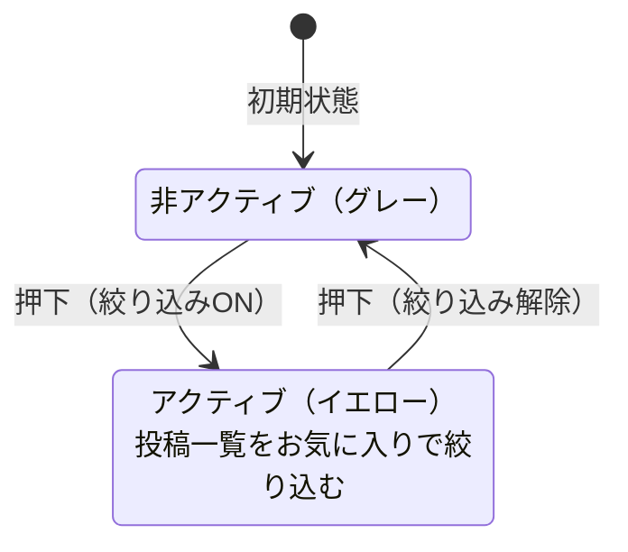

# 目的

- 投稿一覧の画面仕様とUI要素を定義する
- お気に入り絞り込み、個別投稿カード、無限スクロールのユーザー体験を固定する

# スコープ

- 対象
  - 投稿一覧の構成（タイトル、お気に入りボタン）
  - 一覧表示の仕様（レイアウト、件数、並び順、キャッシュ方針の概要）
  - 各投稿カードの表示要素と操作
  - 無限スクロールのユーザー体験
  - ごみ箱ビュー（一覧表示、個別操作、一括削除UI、削除確認モーダル）
- 非対象
  - 取得・キャッシュ・ページングの技術契約（`docs/specs/仕様書 投稿一覧取得-キャッシュ-ページング.md` を正とする）

---

# 投稿一覧の構成

- タイトル
- お気に入りボタン
  - 表示されているメモ・ノートの一覧をお気に入り設定した投稿で絞り込むことができる
  - デフォルトは非アクティブ（グレーアウト）、押下するとアクティブ（イエロー）になる

---

# 投稿一覧の仕様

- 現在アクティブになっているモードの一覧を表示する
  - モード切り替えUIの操作によって自動的にパラメータが付与・変更される
  - URLパラメーター `view` によって内部で `mode` を判定する
  - デフォルトのモードはメモ
- 投稿を立て一列で並べるシンプルなレイアウトで表示する
- 直近n件を表示する（初期値は10アイテム）
- 投稿の並び順の初期値は投稿作成日時の降順（新しいものが上）
- **取得した投稿一覧はキャッシュする**
  - キャッシュを利用し、表示を切り替えたりブラウザの進む/戻るボタンを押下しても取得済みの投稿は即時に復元される
  - キャッシュ方針（TTL/再取得条件）、スクロール位置復元、更新系操作時のキャッシュ整合は `docs/specs/仕様書 投稿一覧取得-キャッシュ-ページング.md` を正とする
- **お気に入りの絞り込み**
  - メモ、ノート、それぞれのモードでお気に入りを絞り込んでいるか、いないかの状態を保持できる
  - お気に入りON/OFF時は、切替先の一覧条件が未取得の場合のみ再取得する
  - 切替先の一覧条件が取得済みの場合は、キャッシュを即時復元し強制再取得はしない

---

# 各投稿の表示要素

- ごみ箱一覧の場合、復元先把握のためモードを表示する
- 作成日（投稿日、**絶対時刻**。表示: `YYYY-MM-DD HH:mm`）
- 投稿本文
  - メモ: 全文表示する
    - 本文中の URL は投稿カード表示時に自動リンク化する（`target="_blank"` / `rel="noopener noreferrer"`）
    - URL 末尾の句読点・括弧などの記号（例: `。` `、` `.` `,` `!` `?` `)` `]` `}`）はリンクに含めない
  - ノート:
    - タイトルがあればタイトルを表示する
    - 本文を全文表示する
- ごみ箱アイコン（削除）
  - 投稿をごみ箱に移動するためのボタン。押下すると投稿一覧からは非表示になる
- 編集ボタン
  - メモ: 押下すると、その投稿の表示領域を **インライン編集**する（メモエディタに差し替え）
  - ノート: 押下すると、モーダルでノートエディタを表示する
- 星型アイコン（お気に入りフラグ）
  - 用途：投稿へのお気に入り付与/解除（お気に入り絞り込みに利用）
  - 押下するとスターがグレーからイエローに変化する
  - イエローのときに押下するとグレーに戻る

---

# 投稿の自動取得（無限スクロール）

- 投稿一覧が表示されているページをスクロールし最下部に到達したとき、次のn件を自動的に取得開始する
- 取得を待っている間はスケルトンUIを表示する（初回/追加読み込みの出し分け、多重発火防止、再試行導線は `docs/specs/仕様書 投稿一覧取得-キャッシュ-ページング.md` を正とする）

---

# ごみ箱ビュー

## 一覧表示

- ごみ箱に移動された投稿は一覧で表示される
- 一覧表示は通常の投稿一覧と同じレイアウトの一覧コンポーネントを利用する
- ごみ箱内の投稿は「ごみ箱に入れた順（新しい→古い）」で表示する
- `view=trash` ではお気に入り絞り込みクエリ（`favoriteMemo`/`favoriteNote`）は評価しない。詳細は `docs/specs/仕様書 URLクエリ状態管理.md` を参照する

## ごみ箱投稿の個別操作

- ごみ箱投稿は次の操作を持つ
  - チェックボックスでチェックの着脱
  - 復元
    - 押下するとごみ箱から非表示になり、元々属していたモードに復元される
  - 完全削除
    - 一覧から削除され、データベースから削除される

## 一括削除UI

- ごみ箱内の投稿すべてに一括でチェックを脱着する機能がある
- ごみ箱表示から通常のモード表示（メモ・ノート）に戻ったら、投稿のチェックボックスはリセットする
- UI
  - 「表示中の投稿を選択」チェックボックス
    - ロード済みの投稿全てにチェックを付ける
    - 無限スクロールで追加ロードされた投稿は自動でチェックしない
    - 1件以上の投稿にチェックが入っているときは、「選択を解除」チェックボックスに入れ替わる
  - 「選択を解除」チェックボックス
    - チェックが付いている投稿の選択をすべて解除する
    - 一部の投稿だけにチェックが入っている場合でも、押下時は選択中の投稿を全解除する（仕様意図）
  - n件を選択中
    - チェックが付いてる投稿の数を表示する
    - 投稿のチェックを監視し、着脱に応じて件数表示を動的に更新する
  - 「選択した投稿を削除」ボタン
    - チェックボックスにチェックが付いている投稿のみ完全削除する
  - 「ごみ箱を空にする」ボタン
    - チェックの有無にかかわらず、未ロード分の投稿も含めて全てのごみ箱内の投稿を完全に削除する

## 完全削除確認モーダル

- 投稿の完全削除を実行するときは、かならず削除確認モーダルを表示してユーザーに確認を促す
- 削除確認モーダル
  - 確認メッセージは操作に応じて分岐する（文言は `docs/specs/テキスト・コンテンツ定義.md`「削除確認モーダル」を参照）
    - 複数選択削除: n=チェック数
    - ごみ箱を空にする: 全件（件数表示なし）
  - 警告メッセージ（この操作は取り消せません）
  - キャンセルボタン: モーダルを閉じる
  - 削除ボタン: 対象の投稿を完全に削除し、成功通知を表示する
    - 失敗した場合はエラー通知（トースト）を表示し、再試行できる導線を提供する（状態維持）
    - 本モーダルは一括削除（複数選択削除／ごみ箱を空にする）でのみ使用する
